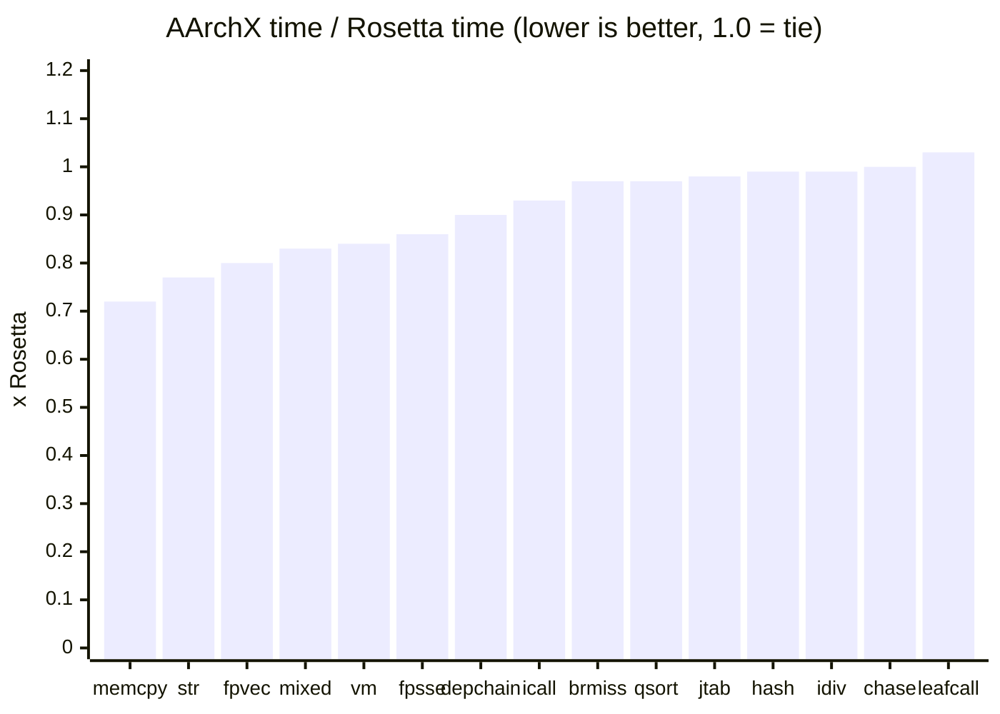

<p align="center">
  
</p>

<h1 align="center"><em>AArchX</em></h1>

<p align="center">
  <b>Run Intel macOS programs on Apple silicon, with a translator written from scratch.</b><br>
  <sub>No Rosetta translation at runtime.</sub><br>
  <sub>Previously called Ocerz. The binary, the source tree and the environment variables still carry that name.</sub>
</p>

<p align="center">
  
  
  
  
</p>

> [!WARNING]
> AArchX is experimental. Do not use it for production workloads.

AArchX takes an x86-64 macOS program, translates its machine code to arm64 and
runs it, the job Rosetta 2 does. Everything in between is its own: the Mach-O
loader, the x86 decoder, an interpreter, an arm64 JIT, a dynamic linker and the
system-call layer. It never calls Rosetta's translator, and on its benchmark
suite it is faster than Rosetta on most kernels.

Apple is ending general-purpose Rosetta after macOS 27. AArchX is an open,
inspectable alternative, and its native mode runs Intel programs against the
Mac's own arm64 frameworks, so they need no x86 system libraries at all.

## Highlights

- **Real software runs.** Cocoa applications such as Safari and Discord, the
  macOS Steam client and games launched from it, Ollama, and Wine, including
  32-bit Windows programs through WoW64.
- **Fast where it counts.** Guest registers live in arm64 registers, flags are
  computed only where they are read, blocks are chained into superblocks, and
  hot string and memory routines run as hand-written arm64. Translations are
  kept on disk and shared between processes.
- **Two ways to supply the system libraries.** Cache mode translates Apple's
  x86-64 shared cache like any other code. Native mode bridges every call into
  the Mac's own arm64 frameworks instead.
- **Correct before fast.** The interpreter is the reference: every guest test
  runs both interpreted and translated and the two must match byte for byte,
  and 20,033 i386 cases are compared register by register.

## Quick start

You need:

- an Apple silicon Mac;
- macOS 26 or 27;
- the Xcode Command Line Tools (`xcode-select --install`);
- Rosetta installed, for cache mode only. It is the package that ships Apple's
  x86-64 shared cache; AArchX maps that file and never runs Rosetta itself.

```sh
make -j
./ocerz version                       # AArchX 0.6
./ocerz tests/guest/bin/hello         # a test program from this repository
./ocerz /Applications/Some.app       # a bundle runs the executable its Info.plist names
```

Arguments after the program go to the program.

Native mode reads API databases generated from your own macOS SDK:

```sh
make apis
./ocerz -native ./some_x86_64_tool
```

`make check` builds and runs every test gate, which takes about half an hour.
[Getting started](docs/getting-started.md) has the details.

## What runs

| Program | Result |
| --- | --- |
| Command-line tools | the 16 checked against native output match byte for byte, and a sweep of 74 system tools agrees with Rosetta |
| Safari, Discord | Safari browses, and Discord reaches its signed-in view (September 2026) |
| Steam, macOS client | full UI with software rendering in cache mode; hardware-accelerated in native mode on macOS 27 |
| Brawlhalla | reaches its menus, launched from Steam |
| Ollama | command line and server work, and the menu-bar app runs |
| Bundled apps: Chess, Calculator, TextEdit and others | open their windows (measured on macOS 26; arm64 only on macOS 27) |
| Wine | 32-bit Notepad and WineMine through WoW64; Windows Steam reaches its main window |
| Counter-Strike 2, under Wine with D3DMetal | reaches its window, then stops on an error Rosetta does not hit |
| Photoshop | stops during startup |

Every result is dated and explained in [Compatibility](docs/compatibility.md),
together with what Steam, the GPU and Wine took to get there.

## Performance

AArchX time divided by Rosetta time, so **lower is better** and anything under
1.0 is faster than Rosetta. Fifteen kernels, linked against libSystem, in cache
mode, on an Apple M5 with macOS 27 (2026-09-21):



The same suite, run back-to-back on this branch's Rust port and the C build on
an Apple M4 Pro VM with macOS 26 (2026-10-09). Both builds beat Rosetta on
thirteen of the fifteen kernels, and the Rust port matches the C build within
run-to-run noise everywhere:

```mermaid
xychart-beta
    title "x Rosetta on M4 Pro / macOS 26: C (first bar) vs Rust port (second)"
    x-axis [memcpy, str, fpvec, mixed, vm, fpsse, depchain, icall, brmiss, qsort, jtab, hash, idiv, chase, leafcall]
    y-axis "x Rosetta" 0 --> 1.2
    bar [0.76, 0.93, 0.79, 0.90, 0.79, 0.83, 0.83, 0.94, 0.95, 1.06, 0.94, 0.99, 0.92, 1.06, 1.02]
    bar [0.74, 0.98, 0.84, 0.90, 0.82, 0.86, 0.83, 0.95, 0.94, 0.97, 0.89, 0.97, 1.01, 1.02, 0.97]
```



AVX2 and FMA loops mostly beat Rosetta too, and a call from native mode into the
Mac's frameworks costs about 17 ns. Startup is the weak spot: everything a large
application runs is translated the first time it runs, so Windows Steam under
Wine needs about 33 s to its main window where Rosetta needs 11 to 12.
[Performance](docs/performance.md) has every mode, the method and the
remaining costs.

## How it works

1. **Load.** AArchX maps the program into a reserved region of its own process,
   the guest arena, and builds the initial stack the kernel would.
2. **Link.** Its own dynamic linker binds the program's imports, either against
   Apple's x86-64 shared cache (cache mode) or against synthesized x86 stubs that
   lead into the Mac's own arm64 frameworks (native mode).
3. **Translate.** x86 instructions are decoded into an internal form and turned
   into arm64 a block at a time. Blocks are cached, chained to each other and
   grown along the paths the program really takes; anything the JIT declines
   runs in the interpreter.
4. **Answer the system.** Guest system calls, Mach messages, threads and signals
   are serviced by AArchX, because most of them need pointers, structures or
   thread identities rewritten on the way through.

A program with one thread runs with plain memory accesses. The first thread,
fork or shared mapping switches it to x86's stronger memory ordering for good.

| | Cache mode | Native mode |
| --- | --- | --- |
| Flag | `-cache`, the default | `-native` |
| System libraries | Apple's x86-64 shared cache, translated | the Mac's own arm64 frameworks, run as they are |
| Needs Rosetta installed | yes, for the cache file | no |
| Runs | the most software | a narrower set, growing |

[Architecture](docs/architecture.md) explains each stage, [Modes](docs/modes.md)
how to choose, and the [Atlas](docs/atlas/index.html) (also at
https://mont127.github.io/AArchX/atlas/) is a guided tour of the source for
contributors.

## Testing

| Gate | Result |
| --- | --- |
| x86-64 guest suite, interpreted and translated | 131 / 131 |
| x86-64 differential, interpreter against JIT | 97 / 97 |
| i386 differential | 20,033 / 20,033 |
| dynamic-linking suite | 113 / 113 |
| native-mode suite | 87 / 87 |

Counted on macOS 27 in September 2026. [Testing](docs/testing.md) says what
each gate proves and lists the component suites.

## Limitations

- Application compatibility is incomplete, and some system calls and framework
  behaviour are still missing.
- Native mode runs Swift programs on a guest copy of the Swift runtime
  (`make guest-swift`), but not yet the system frameworks' Swift APIs; it has
  no bridge for WebKit or GameKit, and stops with a named message on any call it
  cannot make.
- x87 arithmetic computes in 64-bit doubles rather than 80-bit precision
  (loads and stores stay exact), MMX always
  runs in the interpreter, and a few AVX2 forms do as well.
- Large applications start several times slower than under Rosetta.

The full list is in [Compatibility](docs/compatibility.md#known-limitations) and
[Native mode in depth](docs/native-mode.md#what-native-mode-cannot-run-yet).

## Documentation

| Page | What it covers |
| --- | --- |
| [How AArchX works (PDF)](docs/AArchX-Deep-Dive.pdf) | a 231-page deep dive into every part of the translator, for contributors |
| [Getting started](docs/getting-started.md) | requirements, building, running a first program |
| [Modes](docs/modes.md) | cache mode and native mode, and which to pick |
| [Native mode in depth](docs/native-mode.md) | how native mode crosses into the Mac's frameworks, and its limits |
| [Reference](docs/reference.md) | every command-line option, environment variable and exit code |
| [Architecture](docs/architecture.md) | how a program is loaded, translated and run |
| [Performance](docs/performance.md) | results against Rosetta and how to reproduce them |
| [Compatibility](docs/compatibility.md) | what runs, what does not, and known limitations |
| [Troubleshooting](docs/troubleshooting.md) | reading a failure and narrowing it down |
| [Testing](docs/testing.md) | the gates and what each proves |

Every source file also opens with a prose block explaining what it does and why
it is shaped that way; those blocks are the deepest documentation in the
project.

## Contributing

Contributions are welcome. [CONTRIBUTING.md](CONTRIBUTING.md) describes how the
tree is worked on: the gates, the test that pins every change, and the commit
style. Please also read the [code of conduct](CODE_OF_CONDUCT.md), and report
security issues as described in [SECURITY.md](SECURITY.md).

## License

AArchX is free software: you may redistribute it and modify it under the terms of the [GNU Lesser General Public License, version 2.1](LICENSE), or, at your option, any later version. Copyright (c) 2026 mont127.

In one paragraph: anyone may use, build, run, study and redistribute it, and ship it beside their own software, provided the notices stay and the source of this program, including any change made to it, is offered under the same license. Running Intel software through ocerz, or launching ocerz from another program, does not make that program a derivative work; it keeps its own license. Modifying ocerz itself and distributing the result without publishing the modifications is not permitted. The name AArchX is not covered by this license: do not use it to name a modified version or to suggest endorsement. The guest C++ runtime under `runtime/guest` is LLVM's, under its own license (`LICENSE.libcxx.txt`, `LICENSE.libcxxabi.txt`, `LICENSE.libunwind.txt`), and the guest Swift runtime `make guest-swift` installs there is the Swift project's, under the Apache License 2.0 with its Runtime Library Exception (`LICENSE.swift.txt`). Earlier commits carry the license they were published with.

Contributions are accepted under the same license.
